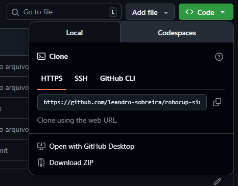

# Robocup-simulation 2D
###### Feito para o Github CodeSpace
___

## 1. Importe esse repositório
Abra seu GitHub e vá em `Create new...`


Após isso clique em `Import repository`


Ou apenas [Clique aqui +](https://github.com/new/import)

Em `The URL for your source repository*` cole isso:
```
https://github.com/leandro-sobreira/robocup-simulation.git
```


Coloque o nome que deseja e clique em `Begin Import`

Espere alguns poucos minutos até completar a importação
___
## 2. Crie um CodeSpace dentro do GitHub

Após importar, entre dentro do seu repositório e clique em `<> Code` depois em `CodeSpaces`


Depois clique em `Create codespace on main`

Agora seu codeSpace está sendo criado (Isso pode levar alguns minutos)

_**OBS.: Nessa configuração o CodeSpace irá funcionar por 60 horas mensais ou 90 horas com o [plano educacional](https://github.com/settings/education/benefits)**_

___
## 3. Comandos e pontos úteis

#### 1. Abrir interface gráfica (noVCL)
Vá em `portas` e na porta 6080 clique em `Abrir no Navegador` 🌐

Uma nova guia irá abrir onde iremos poder visualizar o rcssmonitor

#### 2. Rodar o `RcssServer` e `RcssMonitor`
Digite na sequencia em diferentes terminais:
```
rcsssserver
```
```
rcssmonitor
```

#### 3. Testar com Helios-Base
Digite em 2 terminais:
```
./helios-base/src/start.sh -t NomeTime
```
_OBS.: Cada um dos times precisa ter um nome diferente_