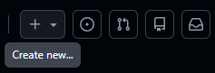
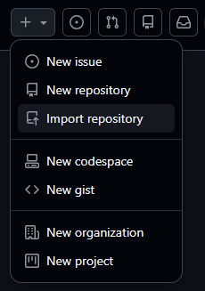
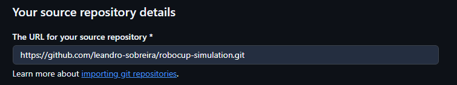
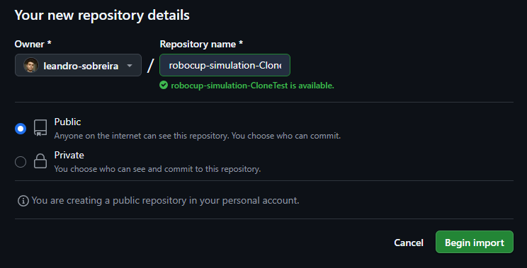
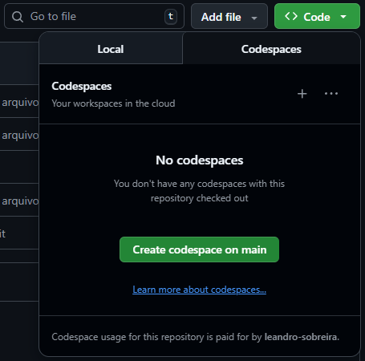
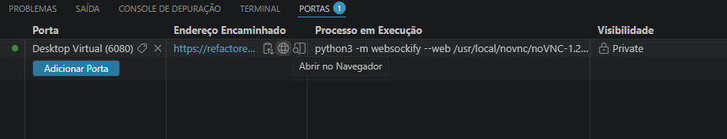

# ⚽ RoboCup Simulation 2D

> Guia de configuração utilizando **GitHub Codespaces**

---

## 🚀 1. Importar o repositório

Acesse o GitHub e clique em **Create new...**



Em seguida, selecione **Import repository**



> Ou acesse diretamente:  
> 👉 https://github.com/new/import

No campo **"The URL for your source repository"**, cole:

```bash
https://github.com/leandro-sobreira/robocup-simulation.git
```
<p align="center">
  
</p>

Depois:

- Defina o nome do repositório
- Clique em **Begin Import**

<p align="center">
  
</p>

⏳ Aguarde alguns minutos até a importação finalizar.

---

## 💻 2. Criar um Codespace

Dentro do repositório importado:

1. Clique em **<> Code**
2. Vá até a aba **Codespaces**
3. Clique em **Create codespace on main**



⏳ O ambiente será criado automaticamente (pode levar alguns minutos).

> ⚠️ **Limites de uso:**
>
> - Plano gratuito: **60h/mês**
> - Plano educacional: **90h/mês**  
> 👉 https://github.com/settings/education/benefits

---

## 🛠️ 3. Comandos e utilidades

### 🌐 Abrir interface gráfica (noVNC)

1. Vá até a aba **Ports**
2. Localize a porta **6080**
3. Clique em **Open in Browser**

<p align="center">
  
</p>

Uma nova aba será aberta com o uma interface gráfica (onde será aberto o **rcssmonitor** em breve)

---

### ⚙️ Rodar `rcssserver` e `rcssmonitor`

Execute em **terminais separados**:

```bash
rcssserver
```

```bash
rcssmonitor
```

---

### 🤖 Testar com Helios Base

Execute em **dois terminais diferentes**:

```bash
./helios-base/src/start.sh -t NomeDoTime
```

> ⚠️ Cada time deve possuir um nome diferente

---

## 📌 Observações

- Certifique-se de que todos os serviços foram iniciados corretamente
- Caso algo não funcione, reinicie o Codespace

<h1 align="center">Agora é só programar, boa sorte!</h1>
